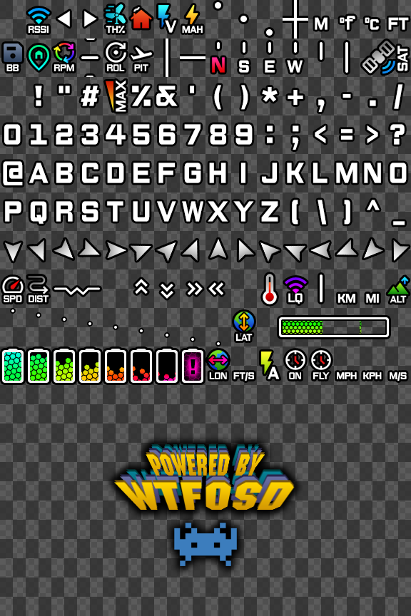

# Neue OSD Font

This is a font set for [msp-osd](https://github.com/fpv-wtf/msp-osd) from [fpv.wtf](https://fpv.wtf/).  
Typeface based on [The Neue Black](https://www.theleagueofmoveabletype.com/the-neue-black).  
Icons mostly based on [Google Material Symbols](https://fonts.google.com/icons).  
Only Betaflight is supported.

Partially referenced on other OSD font sets:  
KNIFA (https://github.com/Knifa/material-osd/releases)  
VICEWIZE (https://github.com/vicewize/vicewizeosdfontset)  
Sneaky FPV (https://drive.google.com/drive/folders/1ygZVgfwB0PaNgp-cQ7IG1cdllWc4DOoe)  

## Installation
1. Unzip and put the .bin files into the root of your goggle's SD card, rename if necessary.  
2. Send it!

## Source  
You should find Photoshop .psd file(s) and merged .png file if you feel the need to mess with this set.  
Created using Photoshop CS6, layer styles, adjustment and smart object layers are heavily used to create visual effects.  
Files generated by [mcm2img](https://github.com/Knifa/mcm2img/tree/templates).

## License  
IDK... Let's say [CC-BY-SA 4.0](https://creativecommons.org/licenses/by-sa/4.0/).
